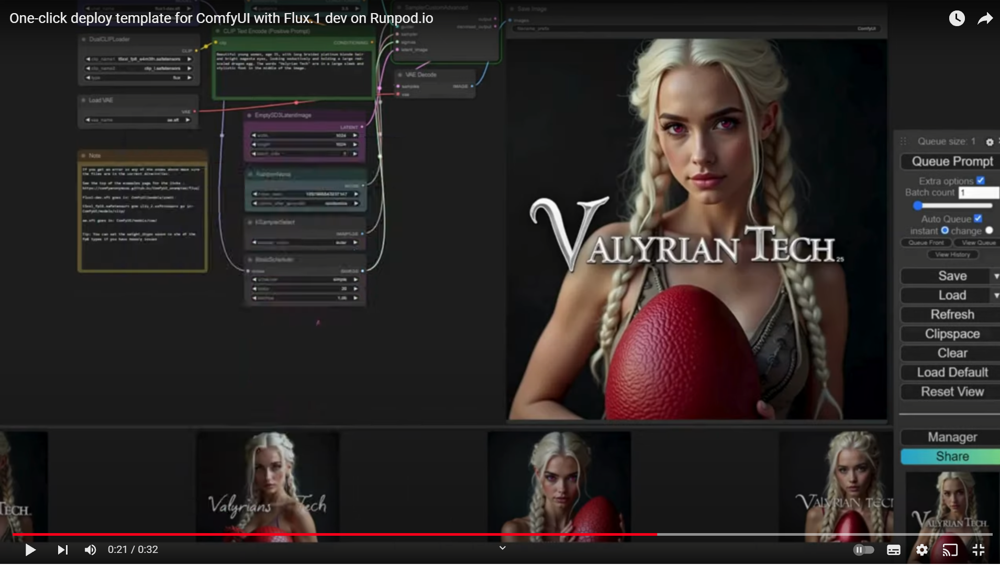

# ComfyUI with Flux.1-dev

## Video

## Overview
Welcome to the one-click deployment template of ComfyUI with Flux.1-dev. This template is designed to help you kickstart your journey with text-to-image conversions and more, without the hassle of extensive setup. 

## Features
- **ComfyUI**: An intuitive interface that makes interacting with your workflows a breeze.
- **Flux.1-dev**: An open-source text-to-image model that powers your conversions.
- **ComfyUI Manager and Custom-Scripts**: These tools come pre-installed to enhance the functionality and customization of your applications.
- **Default Workflows**: Jumpstart your tasks with pre-configured workflows for common tasks such as converting text to image (txt2img) and image to image (img2img).

## Getting Started
Ready to dive in? Simply click on the 'Deploy' button. This will automatically set up ComfyUI with Flux.1-dev on your Runpod.io account, along with the default workflows, ComfyUI Manager, and Custom-Scripts.

## Note
Patience is a virtue! This template includes all the files needed to run ComfyUI with Flux.1-dev, so it is a big file. The deployment process should take about 10 minutes to complete. 

Happy creating!
